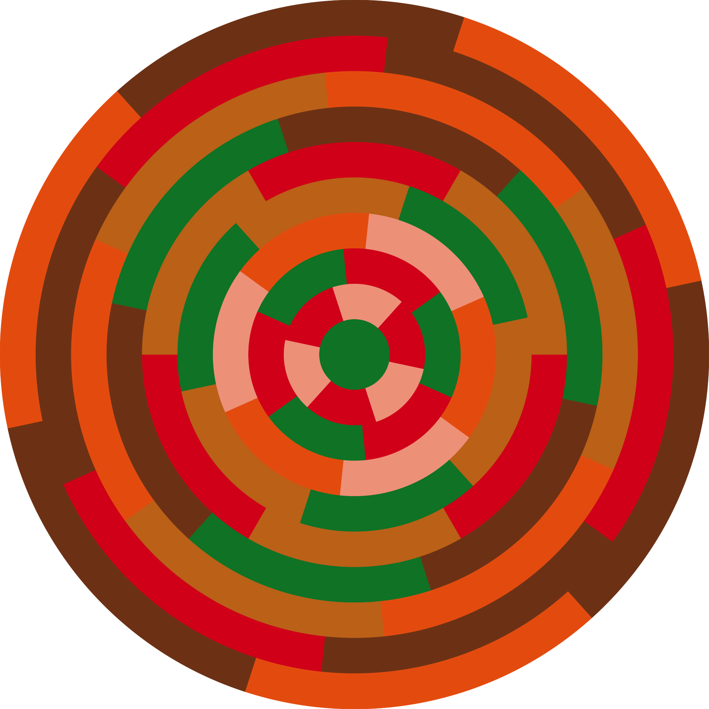

#Mirror animator

##Introduction

This paper describes a novel type of picture making mechanism consisting of mirrors and painted fields.
Throughout the paper we will use multiple variants of a two part sculpture as a working example. The first part is a lattice of small mirrors that will work as pixels or a mosaic. We will adress different lattice configurations and mirror shapes and discuss pros and cons of them. The second part of the sculpture consists of a surface painted with different color fields working as a palette. As we will see the surface may come in many different shapes that allow for different functionality. The end goal is to make the mirrors appear to have a colour and by that making them collectively look like an arbitrary picture that we can choose before fabrication. This is achieved by calculating the direction each mirror has to face to make light bounce off a selected section of the color fields of the palette, off the mirror and into a spectators eye.

> `TODO: We need to explain what we are doing here`
>
> `TODO: Make sure all the figures has the right numbers`
>
> `TODO: Make sure american/commonwealth english is consistent`

##A quick primer on how light works

> `TODO: This might need some extra explanation about frequencies and colors`

Light rays travel in a straight line through a medium (like air). When striking a surface some of the light will be absorbed by the surface (converted to heat) and some will bounce back, reflected. The absorption is what makes object look colorised due to that the surface absorbing some frequencies of light more than others. On a perfectly flat, smooth surface, called a specular surface, the angle of incidence, the angle at witch the light ray hits the surface, is equal to the angle of reflection with regards to a projected line perpendicular to the surface, known as the normal. 

<i>Fig 1. Angle of incident and angle of reflection is equal with regards to normal (dashed)</i>

On rough surfaces, called diffuse surfaces, the light will reflect in slightly different angles all over the surface but still retaining its energy. A mirror is said to be more specular than a painted wall that is said to be diffuse.

<i>Fig 2. Specular reflection</i>

<i>Fig 3. Diffuse reflection</i>

For opaque materials all the light will either have to be reflected or absorbed. If the material is transparent or translucent some of the light might pass into the material. When passing into a material the light ray bends from its angle of incidence. This phenomenon is called refraction. The amount of bending is due to the relative indices of refraction (also called the optical density) of the medium the ray travels from and the medium the ray travels into (described by *Snell's Law*). The larger the difference between the media the more the ray bends[^Snells Law].

<i>Fig 4. Refraction</i>

~~So far we have thought of the light as single rays that strike the middle of the color field, the middle of the mirror and the middle of the spectators eye but that is a too big of a simplification. In reality there are millions of rays bouncing in different directions. We will not consider all of them since that would be too interlectually straining but we need to at least acknoledge that the color fields and mirrors are surfaces and not just points.~~

For our purposes we can largely disregard both refraction and diffuseness. We also don't have to consider translucensy, internal reflections, subsurface scattering, fresnel effects, chromatic aberration or any other obscure phenomena present in the real world since it will not make any noticeable difference that we can adjust for anyway. We will consider the mirrors we use ideal mirrors that are perfectly flat, covered with a perfectly transparent glass with the same refractive index as the surrounding media and the reflective surface to be perfectly specular [^Mirrors].

~~Throughout this article we will calculate with single rays but that is a simplification. We will discuss that more in depth in the section about accounting for distances.~~

[^Snells Law]: To be specific the refractive index varies slightly with the wavelength of light. Generally the refractive index decreases with increasing wavelength. This leads to an effect called *Chromatic aberration* that for example in lenses manifests itself as fringes where the light is split into its constituent frequencies with slightly different focal points. There is also something called *Critical angle* witch is the angle at where light is not refracted but instead reflected. If the angle of incidence is greater than the critical angle all light will be reflected. This is the phenomena that makes fiber cables work by bouncing the light inside a transparent glass fiber, called *total internal reflection*. This is also the phenomena, called the *Fresnel effect*, that makes a calm lake at sunset appear as a mirror although being a poor reflector at normal incidence. For reference air has a refractive index very close to 1.00 while the value for window glass is about 1.52.
[^Mirrors]: In theory it would be possible to use *first surface mirrors* in witch the reflective surface is the front instead of on the back of the glass. First surface mirrors are commonly used in high precision optical equipment such as cameras, telescopes and lasers but are also considerably more expensive starting at around 400 times the price of a regular second surface mirror.

##Colouring a mirror
Since our idealised mirror reflects all light striking it, without absorbing any light, it itself doesn't have any inherent color. It appears as it has the color of whatever it reflects. By, for example, painting a wall with a color spectrum and adjusting the angle of the mirror we can make it reflect any point on that surface we want and thereby taking the color of it. If we want the mirror to look red we can adjust the angle in such a way that it will reflect a red point.

<i>Fig X. The same mirror can appear to be multiple colors by rotating the mirror. In the left picture the mirror will appear blue while in the right it will appear red.</i>

To calculate what angle the mirror has to have to reflect the light from $t$​​ to $e$​​ is fairly trivial. We know that the face of the mirror needs to point in such a way that the angle of incidence and the angle of reflection should be equal in regards to the mirrors surface normal and since we already have all the positions they are easy to compute. Say we have a surface with the center $t$​​. We also have the position of the spectators eye $e$​​ and the center of the mirror $m$​​, which gives us:
$$
\vec{i}=e-m, \vec{r}=t-m
$$
where $\vec{i}$​ denotes the vector of incidence and $\vec{r}$​ the vector of reflectance. The mirrors normal $\hat{m}$​ (i.e. the vector that the face points in) is just the average of the normalised[^Normal vector] vectors  of incidence and reflectance:
$$
\hat{m}=\frac{\hat{i}^{-1}+\hat{r}}{2}
$$
This amounts bisecting the angle between the normalised vectors of incidence and reflection witch can be done by adding the two vectors and then splitting the resulting vector by half making it a unit vector.

<i>Fig 5. A visual representation of Equation 2. finding the normal (green). The blue represents the inverted vector of incidence and red reflected. Adding blue and red and then scaling the sum by 0.5 gives green. From the eye´s point of view the mirror will appear red.</i>

This gives us the basic tools to "colour" our mirrors. In the figures above this has been shown to work in two dimensions (for clarity) but the math generalises to three dimensions effortlessly and when creating this in real life we will of course need to use all those three dimensions. 

We can now create a "color palette" that we then can "sample" colors from by adjusting the angle of our mirror. If this mirror is fairly small it us the ability to essentially make a pixel that can take any color from the palette and reflect that into the spectators eye.

If we want another color we can just realign the mirror to reflect another color. Since realigning a mirror can be a bit fiddly we instead opt for moving the palette so the mirror reflects another color field. Moving the spectator, the mirrors or the palette in relation to each other creates the same result.

[^Normal vector]: A normalised unit vector is denoted with a hat, e.g.  $\hat{r}=\frac{\vec{r}}{\|\vec{r}\|}$​​​​​​ where the magnitude of a vector is denoted with double bars. The magnitude can be computed, in 3d euclidian space, with *Pythagoras theorem*: $\|\vec{r}\| = \sqrt{r_x^2 + r_y^2 + r_z^2}$​​​​​​

##Shape of mirrors

We want the picture in the mirror to be vibrant so we need to reflect as much light as possible trying to cover as much of the substrate that the mirrors are glued. All the area not covered by a mirror will be painted in a solid color that will then affect the overall picture, basically tinting it in that solid background color. There are infinitely many options of tiling a plane but it's only easy to find square and round circles off the shelf. Fabricating thousands of odd shaped mirrors is not really a viable option. 

Square tiling of a plane is 100% efficient but for reasons we will discuss later using round mirrors have some good properties (that we will discuss in the manufacturing section). Round mirrors arranged in a regular grid will leave a lot of gaps between them that does not reflect any light (or it will reflect light, just not the light we want) that will lead to a desaturated, washed out picture. The most dense packing of circles on a plane, making more of the surface be mirrors, is the hexagonal array packing. 

<i>Fig X. Hexagonal array packing</i>

This is the same packing bees use for their beehives [^Circle packing]. This minimises the space between the mirrors and hence reflect more light per unit area and therefore allow for a more vivid image.

[^Circle packing]: The density of packing circles on a plane with diameter $D$ is $\frac{3\pi}{4}D^2 \big/ \frac{3\sqrt{3}}{2}D^2= \frac{\pi\sqrt{3}}{6} \approx 0.9069$ i.e. about 10% of the light will be hitting the substrate instead of a mirror.

##Accounting for distances and angles

Although the light rays starts at a light source, bounces and scatters of the coloured surfaces, reflects in the mirrors and strikes the spectators retina it is easier to think of the process in reverse. The math will add up the same in both directions[^Thermodynamics]. If we think of the rays from the eye (so in reverse) that strike the mirror they will actually form a cone with the apex in the eye and  the base covering the mirrors surface. This cone is usually called a *frustum*[^Frustum] and represents the region visible in the mirror reflection. When the rays reflect in the mirrors the frustum will continue extending with the same taper until it strikes the color fields. The surface area that will be covered by the frustum on the color fields is related to the surface area of the mirrors and the combined distances between the eye, mirror and color surfaces.

Doubling that distance will quadruple the area (due to the _The inverse square law_). This is important since having too small color fields in relation to the distance from the mirrors will make the mirror pick up a larger area than one color field.

<i>Fig 6. The frustum extends from the eye to the mirror (stroked) and is reflected. The reflected part of the frustum is then larger than the colour field (red) picking up the color of whatever surrounds it.</i>

There is another phenomena that we have to at least consider: One could assume that the shape reflected in a round mirror would also be round but that is not always the case. If the frustum from the mirror and the color fields does not strike the color fields completely perpendicular the frustum will be "cut off" at a slanted angle, in geometry this shape is called *a conic section* and form an eclipse[^Ellipse]. An example of this is when you are out walking a dark night and shine your torch light on the ground. If you shine it straight down you would see a circular light beam but if you shine it further ahead of you it forms an ellipse. The further away from you the more elliptical and larger the lights shape will be.

<i>Fig 7. Here a light beam (magenta) is reflected in a circular mirror (bottom) at 45° and strikes an imagined parallel wall. The resulting conic section (blue) is elliptical.</i>

<i>Fig 8. The same scene as Fig 7. but viewing straight down at the mirror (the rightmost black circle). The elliptical conic section is apparent.</i>

This means that the reflected surface of the color field will not generally be a perfect circle but an ellipse. Depending on where on the color fields the mirrors are reflecting the shape of the reflecting area will be differently shaped and sized. We need to make sure that the entire area of the reflected shape will be within the color field.

The more extreme the angle of incidence of the cone the more extreme the proportions of the ellipse will be. As the angle of incidence approaches tangency to the surface the length of ellipses major axis will approach infinity. 

[^Thermodynamics]: This is actually a fundamental law of thermodynamics that all optics are reversible
[^Ellipse]: The conic section is actually one of the mathematical definitions of an ellipse.
[^Frustum]: Technically a frustum is a geometric shape that has two parallel planes but here we use it slightly looser as *viewing frustum* is generally used in the computer graphics literature.

##A picture

By putting multiple mirrors in a two dimensional lattice, and rotating them individually towards different color fields on the color palette we can create any arbitrary image. Needless to say each mirror does not need a separate color field but multiple mirrors that require the same color can all point to the same spot on the color palette.

One way we could do is to line up all the colors in the palette in a vertical column and have the mirrors point to whatever color it needs to reflect. This configuration will be useful as we will see in the next section.

<i>Fig X. Multiple mirrors rotated in such a way that they reflect one single colour of choice.</i>

##Making an animation

So far we have 

If we now swap out the palette with another we can change all the colors in the picture. By placing two vertical lines of colors we can just slide the lines left or right to change column and hence the palette.

> `<PICTURE 8> of sliding the palette`

As an example we are going to animate between these two images consisting of five colors:

> `<PICTURE 9> Two example images`
>
> `<PICTURE 10> Two example images palette`
>
> `<PICTURE 11> Two example palette sequences`
>
> `<PICTURE 12> Mirrors assigned to sequences`
>
> 

When we create the palette array we see that every mirror is now essentially pointing to a sequence of colors instead of just one color, to the left the colors from the first picture and to the right the second. This means that the each column might have to contain multiple copies of one color. One mirror might for example need red in the first palette and blue in the seconds and another mirror might need red and then green.

By moving the palette horizontally we can now switch from the first to the second picture. Note that it is also possible to shift the mirrors or the spectator for the same effect. 

If we want more frames to our animation we could just add another vertical line. One problem that will be apparent really quickly is that the more frames we add and the more colors we add will grow the color fields to cover a wall. Adding more colors and/or frames requires you to add more horizontal sections to be able to create all possible sequences. The number of sequences that can be created with $x$ colors and $y$ frames is $y*x^y$. This means that having three colors and three frames will in the worst case make $2*5^2 = 50$ color fields to be able to fit all possible combinations. For longer or more colourful animations it will become a problem of fitting the color palette into a room.

~~Since each mirror first points a color in the first vertical line and then the seconds and the third etc. we could save some space by putting the colors on a cylinder that rotates around its vertical axis. This whould make us fit 3.14 times more vertical lines in the same horizontal space but at a cost of some space in the depth direction.~~

##Optimisation attempt: De Bruijn sequences
One observation that can be made is that one horizontal sequence might start with the same colors as another ends with. It might be possible to put all sequences in one long horizontal line and let some sequences overlap each other reducing the total number of color fields. For animations with more frames there might be an even larger overlap where one sequence first two colors is the same as anothers last two colors etc. If we keep on doing this we will eventually have something called a _De Bruijn sequence_. A De Bruijn sequence is a sequence that contains every possible subsequence of a particular length exactly once. 
It is actually possible to compute the De Bruijn sequence rather easily although we will not go into the details of it here but instead just assume we can do it. We now have one color line instead of a color grid.

For example this naïve sequence that is made up by concatenating all two letter combinations of A, B , C, D and E (we are using letters here instead of colors for clarity). Of course it contains all two letter subsequences e.g. AB, DA, BD, DD (in bold) etc. since it was made from it in the first place but we can see that there are multiple instances of many of the combinations. For example there are more than one BC (underlined) witch is redundant.

A A **A B** A C A **D A** E B A B B <u>B C</u> **B D** B E C A C <u>B C</u> C C D C E D A D B D C **D D** D E E A E B E C E D E E

Below is the De Bruijn sequence, also containing all two letter subsequences but with the difference that it does not contain any duplicates and hence is much shorter. The bolded letters are still present but the underlined BC subsequence only appears once (as well as all other possible subsequences).

A **A B** A C A **D A** E B <u>B C</u> **B D** B E C C D C E **D D** E E A

In the previous example with the naïve implementation we needed to use $y*x^y = 50$ fields while we with a De Bruijn sequence only need $x^y = 25$ to fit all possible color sequences.

> `<PICTURE 13> of the naive and the de bruijn sequence for the example picture` 

Now, we might not actually need all the color fields in the De Bruijn sequence. There might not be a transition from A to A and in that case we can prune away those fields and end up with an even shorter sequence.

The only drawback with using a De Bruijn sequence is that it needs to be in one continues line witch is not very space efficient. We'd like to have the ratio of the height and the width of the full color palette as close to $1.0$ as possible since we get less conic distortions by having the mirrors set with shallow angles.

##Optimisation attempt: Disc shaped palettes

The sequence can be awfully long so it might be an idea to try to pack the color fields for example in a color circle instead of a color line. By doing this we will also trade a lot of horizontal space for a little vertical space making the entire contraption a bit more manageable. This also means that instead of moving the color fields horizontally we need to start rotating something. If the center of the color circle, the center of the mirrors and the center of the spectators eye lies on the same line we can rotate either the color circle or the mirrors. We any of them are not we can only rotate the color circle and still produce the effect.
Using a disc also has the fortunate side effect of making the animation automatically loop by simply continuing to rotate the disc.

> `<PICTURE> of a vanilla round palette`

##### Increasing frame-rate by duplication

To make the frame rate higher without spinning the disc faster we can duplicate the color fields in each radial section. So instead of having the sequence ABC we can have ABCABCABC. It doesn't change any of the other optimisations but requires less movement to advance to the next frame hence a higher frame rate.

> `<PICTURE> of a duplicated round palette`

##### Helix shifts (staggering)

We can also shift each radial sequence a little in relation to each other on the palette. This can either make it look more random (to deliberately enhance the confusion of how it works) or if they are shifted by a set amount make something that looks like a helix spiralling towards the centre.

> `<PICTURE> of a helixed duplicated palette`

##### Sizes of concentric section areas

https://francoisbest.com/posts/2021/hashvatars

##### Randomised aiming points

When a lot of mirrors are facing a few amount of spots on the palette one can discern the outlines from the images from regularities in the mirrors even if the color palette is removed witch discloses the encoded image premature. 

> `<PICTURE> of the discerned outlines`

This can be partially fixed. If we have duplicated the sequences there are multiple, equally good, points on the color palette that has the same temporal sequence. Each mirror can therefore randomly select any of the possible points. This will add some noise reducing the effect.

>  `<PICTURE> of the regular aiming point and then the randomized`

#####Sorting the sequence rings with Shannon entropy

The radial ordering of the sequences (rings) are generally arbitrary. The sequences closer to the middle cover a smaller area since the circumference increases with radius. Since the mirrors might not be totally exact due to the fabrication process it can be a good idea to have more information density in the periphery of the disc where the area are bigger. We could for example sort the sequences in a way such as we put the single color sequences end up close to the middle and the sequences with multiple colors end up close to the periphery. An over engineering method (that I've opted to go with) is to sort the sequences on their Shannon entropy. Shannon entropy of $X$ is defined as:
$$
\Eta(X) = -\sum_{i=1}^n {\mathrm{P}(x_i) \log \mathrm{P}(x_i)}
$$
Where $$x_1, ..., x_n$$ is the possible outcomes which occur with probability $$\mathrm{P}(x_1), ..., \mathrm{P}(x_n)$$.
We don't really have to dwell too long on the nitty gritty but can conclude we can compute a number for each line that will be lower if not much happens in the sequence and high if there is a lot happening. We can then use that to sort the radial rings.

> `<PICTURE> some examples of shannon entropy values?`

##Optimisation: Reusing multiple sequence loops

We can also use some ideas discovered earlier to make the following observation: If we make the sequences cyclical, some of those sequences will equal to another sequence if rotated. So if we make the color sequences into concentric color circles we will be able to prune some rotational duplicates. 

For example the circular sequence ABC is isomorphic to BCA and CAB (by repeatedly put the first letter last). This is great news since we, just like that, can divide the number of sequences by the number of frames.

This has the greatest effect with few colors and a lot of colors that are reused in the different images.

> `<PICTURE>` of reducing rotational symmetries

##Optimisation: Do not overlap pictures 
If all pictures in an animation uses the same colors for one particular mirror and each picture only overlaps a solid background color of the other pictures the resulting number of sequences are exactly equal to the number of colors. This can only be used if sequence offsets can be used since all encodings goes from color to background and hence all combinations can be achieved with only sequence offsets. The big drawback is of course that not all animations can be made.

`<PICTURE>` Showing non overlapping pictures

## Pruning when having too many sequences

Sometimes the number of colors and/or frames are too high and we end up with too many sequences. When there are too many sequences it is hard to fit all of them in any given space. One last resort can then be to try to prune sequences by repeatedly removing the least used and replacing it with a sequence that it pretty similar. To do this we need to be able to quantise color difference and luckily someone has already figured that out for us with something called _CIELAB $\Delta$E*94_ [^CIELab] or Delta-E for short.

Delta-E quantifies the difference between two colors as perceived by the human vision. What we get out is a number ranging from 0.0 to 100.0. Values below 1.0 is not perceivable by the human eye. Values between 1 and 2 can be perceived by close observation, 2-10 at a glance. Values between 11 and 49 means the colors are more similar than opposite and the value 100 means the colors are exact opposites. 

By comparing the candidate-for-removal-sequence (the least used one) with all other non-candidate sequences it is possible to compute a square mean difference (its usually better to compute the square mean instead of just the plain mean to inflate big differences and suppress small). Then all mirrors using the soon-to-be removed sequence is set to instead use the sequence with the least difference.

> `<PICTURE> some examples of reducing sequneces`

[^CIELab]: CIE stands for _the **I**nternational **C**ommission on **I**llumination_. LAB for L\*a\*b witch is a color space used to representing colors. The L stands for perceived **L**ightness while the a\* and b\* for the four unique colors of human vision: red, green, blue, and yellow. Further in the $\Delta$​​​​​​​​E* part the greek letter delta commonly denotes difference and the E stands for *Empfindung*; German for "sensation". 94 means it was published in 1994. To compute the difference of two colors: $\Delta E_{94}^* = \sqrt{ \left(\frac{\Delta L^*}{k_L S_L}\right)^2 + \left(\frac{\Delta C^*_{ab}}{k_C S_C}\right)^2 + \left(\frac{\Delta H^*_{ab}}{k_H S_H}\right)^2 }$​​​​​​​​ where $\Delta L^* = L^*_1 - L^*_2$​​​​​​​, $ C^*_1 =\sqrt{ {a^*_1}^2 + {b^*_1}^2 }$​​​​​​, $C^*_2 =\sqrt{ {a^*_2}^2 + {b^*_2}^2 }$​​​​​,$\Delta C^*_{ab} =C^*_1 - C^*_2$​​​​​, $\Delta H^*_{ab} =\sqrt{ {\Delta E^*_{ab}}^2 - {\Delta L^*}^2 - {\Delta C^*_{ab}}^2 } =\sqrt{ {\Delta a^*}^2 + {\Delta b^*}^2 - {\Delta C^*_{ab}}^2 }$​​​​​, $\Delta a^* =a^*_1 - a^*_2$​​​​​, $\Delta b^* =b^*_1 - b^*_2$​​​​, $S_L =1$​​​, $ S_C =1+K_1 C^*_1$​​, $S_H =1+K_2 C^*_1$​​​​​​​​

##Palette arrangements

* Disc
* Cylinder
* Ring
* Internal Cylinder
* Conveyor
* X-Lines
* Y-Lines
* XY-Grid
* Interlaced grid
* Just different color fields randomly positioned
* Multiple palettes
* Combination of palette types
* Stippling with light

## Shape of mirror board and mirror arrangement
* Stippling
* Hex lattice
* Grid lattice
* Freeform

##Positioning and angles

The relative positions of the mirrors, color disc and spectator makes for different pros and cons. In this section we are going to investigate them.

The first option is to put the color disc against a wall, put the mirrors facing the disc and then the spectator in-between facing the mirrors. In this configuration both the disc and the mirrors can be rotated to play the animation as long as they all share the same axis of rotation. Rotating one or the other doesn't really matter. The obvious downside of this is that the spectator will obscure some of the color disc. It is also not obvious for the spectator where the focus point for the mirrors are. This can be both good and bad. Good because it will be surprising when the sweet spot is finally found but bad since it might be hard to find it.

To remedy both those downside one can put a small hole in the middle of the disc and set the focal point in the middle of that hole. The spectator would then stand behind the disc looking though the hole at the mirrors. One downside with this configuration is that one have to actively search out the focal point. One could not just walk passed and happen to find it as a surprise. It also means that the disc has to be free standing in the room instead of being able to be mounted on a wall. This adds some additional complexity to the construction. The back side of the disc needs to be fabricated etc.

The third option is to put the mirrors perpendicular to the disc between the spectator and the disc in the depth direction but slightly to the side. In this configuration only the disc can be rotated to play the animation for geometric reasons. The disc can be hung on the wall and there is a possibility to randomly discover the picture by just walking by. The spectator is also not in the way of any of the light rays. One has to consider that the distance between the some of the mirrors and the disc will differ quite substantially in relation to the cone shape of the arrays from each mirror. Mirrors further away from the disc will reflect a larger area on the disc than mirrors closer to the disc.

##Being smart with the animation

##Simulating in Blender

##Selecting a picture

Criteria I have set up for myself for the selections of pictures.

- Good looking color palette 
- Good if the picture has high contrast since it might desaturate in the mirrors
- Good if it's a recognisable object so its easier to see if its a bit noisy
- Good if the pictures are high complexity so it gets more mind boggling 
- Good if there are few colors to lower the number of sequences
- Good if there are a lot of frames (also adding to number of sequences though) to heighten perceived complexity
- Good if the pictures are different for greater effect between frames
- Good if the pictures are unsimilar to color disc for mind boggelingness
- Good if mixing words and pictures to show unsimilarity between pictures
- Good if there is a concept to the pictures
- Good if the pictures are a bit fun
- Good if the colors sequences can be kept low but at the same time having a high complexity image by being smart with the colors.
- Good if the sequences can be permutated since there are a lot of starting points that way

# Machining

## 3d-printing

## Using 3-axis CNC

## Using 5-axis CNC

## Using 6+1 axis KUKA robot

## Mounting disc

## Painting the disc

## Calibration mirrors

