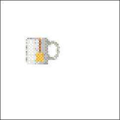
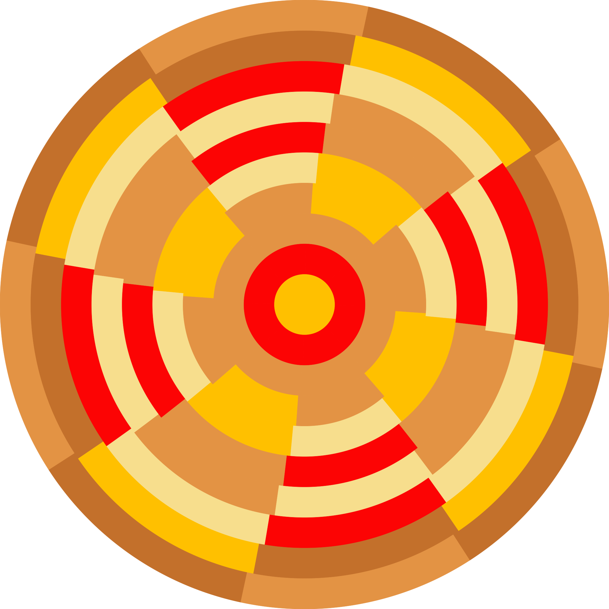
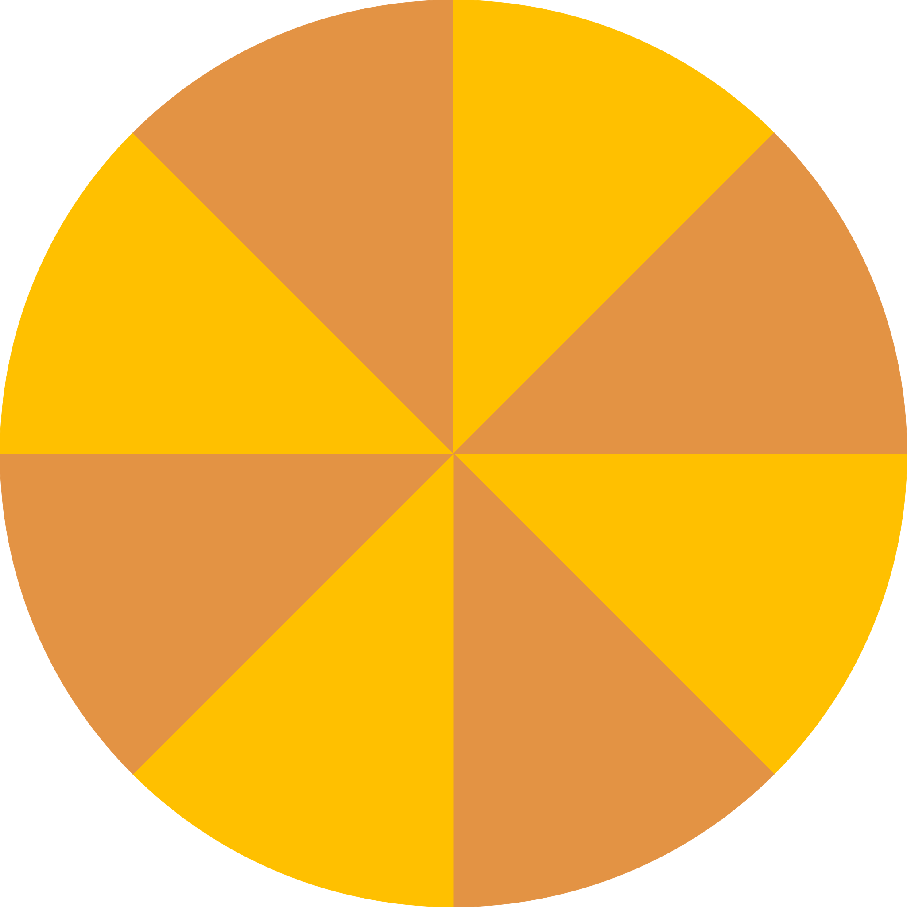
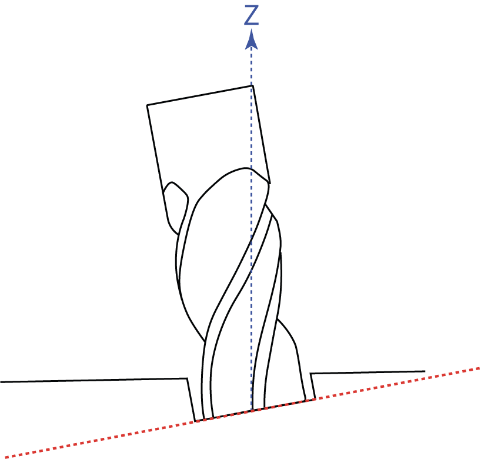

# 	Mirror animator

Draft

## Abstract

I present a novel optical device capable of faithfully reproducing arbitrary images and image sequences by utilizing the interplay between mirrors and coloured surfaces acting as intaeractive mosaics.
My main contribution is describing a method for precomputing the mirror lattice configuration and mirror orientation as well as a ways of finding the corresponding diffuse colour pattern in the spatio-temporal domain. 
The method is fast enough to allow rapid iteration by enabling physically based light ray simulation ahead of fabrication.
I demonstrate the effectiveness of my method in a wide range of image and image sequence scenarios as well as multiple device configuration variants.

> `TODO: footnotes should be at the end of each page not at the very end`

> `TODO: figure references needs to be fixed`

## Introduction

This master thesis assay is supposed to complement and give a more thorough understanding of my master exhibition. As I see myself as a object maker rather than a writer I see the exhibition as the main work and that this paper is the support. While this paper is published deep in the humanities in the fine art department I have opted to write it a little bit more like one would write an in-depth technical blog or repo readme[^repo-readme] post that might be more familiar to the _natural scientist_ or the casual hobby coder. I will not go full techno on you but this paper will demand some prior knowledge of optics and combinatorics to fully comprehend all concepts. That said I will try to focus on the intuition[^Intuition] and add extensive figures and footnotes where a novice reader of the field can find a primer and an experienced reader some more depth and details. If you don't feel comfortable with the nitty gritty as for example the math figures you can just skip ahead. Since I want this article to work as a traditional readme-file as well as a science paper I want it to be possible to reproduce the results by following along in the text. That is why I have insisted to keep the mathematical notation and technicalities to retain utility even though most readers of fine art master theses probably won't care.

The sculptures I present here are a new kind of device, contraption or idea that can show images without any (required) moving parts or electricity. One can say that it is an analogue passive display. It is using illuminated pixels just as a computer screen[^computerscreen] does, but in my case the pixels are not small lamps but mirrors. Each mirror works just as a pixel or a mosaic tile contributing with one small piece of the overall image. By orienting each mirror so that they reflect a colour from somewhere else in the room it is possible to make the mirror appear to have a colour. Hence, by painting a surface in a room it is possible to make sure that any desired colour are available to be reflected. After realising that it is possible to reflect a predetermined color from a predetermined position in the room one can experiment with endless possibilities of arranging the colours to be reflected. I have focused on four different variants that I will talk about in this paper that I have also built physical models of. The first one consists of a disc with painted eccentric colour fields. This variant makes it possible to create animations by having the disc rotate around its minor axis thereby alternating what colours is at the reflection focal points. The second variant is a cylinder that rotates around its vertical axis and also enables an animation. Then I'm showing the most basic variant which consists of a rectilinear array of colour fields that in my case only creates one image per mirror setup but can be used to show multiple images using multiple mirror setups but reusing the colour fields. 

I have structured this paper to discuss all the elements of making an image with mirrors and colour fields including:

- History and background
- Picking a suitable image or images for reproduction.
- Selecting a optimised colour palette
- Ways of refining the reduced palette to create perceived gradients and shades.
- Considerations of how to arrange the mirrors.
- A brief primer on light transport
- How to compute the orientation of each individual mirror.
- Different shapes of colour palettes including discs, cylinders, rectangles and cones.
- Some tricks used to optimise and reduce the physical space occupied by the colour fields.
- Using Software to simulate the mirror setups for rapid iterations.
- Fabricating the mirror array panel using a 6-axis Kuka robot arm, a 5-axis CNC milling machine, a 3-axis CNC milling machine or a 3d printer.

## A brief history and background

Fine art has a long history of making pictures that exploit how the human vision merges small dots in close proximity into perceiving it as one coherent shape. One example is ceramic, class or stone mosaics with examples as old as the 3^rd^ millennia BCE in Mesopotamia. Mosaic patterns with pictures became widespread during the classical era both in Ancient Greece and Ancient Rome. This is maybe the first example of using small coloured dots that blend in the human perception into a picture.

In the late 1800s a painting technique called _Pointillism_ emerged with prolific practitioners like Georges Seurat[^seurat1886] , Vincent can Gogh[^vangogh1887] and Paul Signac [^signac1901] and a bit later for example Robert Delauney[^delauney1906]. Pointillism heavily relies on the fact that small dots of paint close together is merged in the human brain into a single surface. Instead of using a lot of colour shades some shades can be made by mixing dark and light dots with different densities. This phenomena is exploited in many related but distinct techniques in different media. In printmaking the technique is adapted to paper and called _half toning_ where dots of, usually, cyan, magenta, yellow and black ink are printed in a raster with different sizes. In computer science where it is usually restricted to rectilinear arrays it is called _dithering_ and usually includes a restricted color palette. In engraving there is a technique called _stippling_ that similar to pointillism but only one colour is used. All techniques are basically the same with some modifications for each medium. 

When artists got access to the early computers in the 60s the output was usually limited to a paper strip that was printed with a fixed-width font (e.g typewriter typefaces like Courier). Computer art pioneers like Kenneth Knowlton and Leon Harmon[^knowlton1967] used those limitations and made shaded pictures with only text by treating the different characters as different gray scale pixels. This has later become known as ASCII-art[^ascii-art]. In the mid 70's to early 80's this was one of the most common computer game graphics modes. With the release of 8-bit (256 color) video game console _Nintendo Entertainment System_ in the early 1980s the _8-bit pixel art_ was popularised and featured lots of perceptual tricks using the limits of what pictures can be made with a very limited palette. 

Using mirrors and optics to create a picture is also not a new idea. The Stanford physics PhD Ben Bartlett[^bartlett2021] used a similar and independently invented idea as mine just a month ago to project a "Will you marry me" message to his future partner on a beach with a hand held 3d-printed array of small mirrors. Interestingly for this paper he has also published a technical readme-writeup in his GitHub-repo. From academia we have for example got the interesting paper called _High-contrast Computational Caustic Design_[^schwartzburg2014] that was published in 2014 describing how a flat transparent surface can be shaped so that the caustics[^caustics] produce an arbitrary picture. Using the same technique the less academic but still-aerospace-engineer Matt Ferraro published a technical writeup[^ferraro2021] with sourcecode in 2021 where he explains how to make your own with a CNC-router while leaning heavily on a previous paper from 2014 by Yue et al. [^yue-2014]. When researching this paper I found that Swedish artist Christian Partos [^partos2003] used a similar idea as mine but instead of colour-fields he used the falloff from a spotlight as the palette. I would also like to mention Daniel Rozin[^rozin2011] who has made multiple sculptures involving mirrors (although computer controlled).

[^ascii-art]:  The name ASCII comes from the 1963 character encoding called _American Standard Code for Information Interchange_ specifying what characters that can be used
[^partos2003]: Christian Partos, 2003, _MOM (Multi Oriented Mirrors)_, http://www.partos.se/Www/SidorE/MOM.htm
[^bartlett2021]: Ben Bartlett, 2021, _3d-printed-mirror_array_,  https://github.com/bencbartlett/3D-printed-mirror-array
[^schwartzburg2014]: Yuliy Schwartzburg, Romain Testuz, Andrea Tagliasacchi Mark Pauly, 2014, _High-contrast Computational Caustic Design_
[^vangogh1887]: Vincent van Gogh, 1887, _Self Portrait_, oil on canvas,  41 × 32.5 cm, Art institute of Chicago
[^seurat1886]: Georges Seurat, 1884–1886, _A Sunday Afternoon on the Island of La Grande Jatte_, oil on canvas, 207.6 × 308 cm, Art Institute of Chicago
[^signac1901]: Paul Signac, 1901, _L'Hirondelle Steamer on the Seine_, oil on canvas, National Gallery in Prague
[^ferraro2021]: Matt Ferraro, 2021, _Hiding Images in Plain Sight: The Physics Of Magic Windows_ , https://mattferraro.dev/posts/caustics-engineering
[^yue-2014]: Yonghao Yue, Kei Iwasaki, Bing-Yu Chen, Yoshinori Dobashi and Tomoyuki Nishita, 2014, *Poisson-Based Continuous Surface Generation for Goal-Based Caustics*
[^delauney1906]: Robert Delaunay, 1906, _Jean Metzinger_, oil on paper, 54.9 × 43.2 cm, Museum of Fine Arts, Houston
[^knowlton1967]: Ken Knowlton, Leon Harmon, 1967, _Computer Nude (Studies in Perception I)_, 86.36 x 182.88 cm, silkscreen print
[^rozin2011]: Daniel Rozin, 2011, _Brushed metal mirror_, http://www.smoothware.com/danny/brushedmetalmirror.html
[^caustics]: When for example the sun rays hit the water of a pool they refract penetrating the waves and fills the bottom of the pool non-uniformally with areas of high light intensity and others with low. This phenomena is called caustics.
[^computerscreen]: The most common type of computer screens are called Liquid Crystal Display or LCD. It works by shining a white back light on a liquid crystal film. By applying a polarised electrical current to the LCD-film the film can change from opaque to transparent or vice versa. By having red, green and blue filters the transmitted light can be either red, green or blue. Combining red, green and blue light with different intensities one can make the human eye perceive that it is possible to reproduce a large portion of the visible spectrum. One unit of red, green and blue is called a pixel. By putting a huge number of pixels together in a grid one can make electronic mosaics and produce any picture or animation.
[^repo-readme]: Open source projects hosted publicly traditionally have a file called `README` that is intended to be read by users or contributors of the project before use. The readme file is usually placed in the root folder of the repository and commonly contains instructions on how to compile and run the project, some code examples, code formatting and style rules and sometimes more in-depth description of architectural design.
[^Intuition]: In mathematics the term _intuition_ refers to a way to reason to a solution of a mathematical problem using a broader understanding of a mathematical concepts. It doesn't have to be a formal proof but more commonly an example. Explaining solutions by first describing the intuition is very common in geometry where it is commonly possible to describe problems in e.g. lower dimensions.
[^loremipsum]: Lorem Ipsum is the first two words of a placeholder text commonly used in publishing and graphic design to demonstrate the visual form of a document without replying on meaningful content.

## Picking a suitable image or images for reproduction

As will become apparent in just a few moments it is a lot easier to reproduce an image that contains few unique colours than one that contains all possible shades. This is usually referred to a _reduced palette_ in contrast to use all possible colours. The obvious drawback of using a reduced palettes is that the fidelity of the image will also be reduced if the originals palette does not match the reduced. Fortunately computer games had to work with the same limitations[^early_computers] for many years during the 70's, 80's and early 90's so a lot of research has been put in to find clever ways to hide the artefacts that appears when using a reduced palette.

In general there are two kinds of images that works well with a reduced palette. Either very noisy images with a lot of high-frequency details [^high-frequency-details]or solid colour fields as for example cartoons. The in-between with smooth gradients are trickier. The reason noisy images works well is that when you reduce the colour palette the result will also be noisy and the image will be perceived as noisy both before and after. Low frequency details like shades and gradients tend to produce aliasing artefacts that is more difficult to hide with few colours. Cartoon style images doesn't contain shades or gradients and are produced with the constraint of a reduced palette in mind.

The image one wants to create generally is going to be low resolution given the fact that one will have to fabricate it later and an image with two million mirrors will be quite a project. One can also bear in mind each mirror will be very large in comparison to for example a computer screen pixel.  It can be smart to take inspiration from digital images that are made to work being very small. The obvious example that comes to mind is application icons that are ment to be legible even at very small sizes. Another inspiration can be emojis or emoticons that are created to flow in text[^pixel-density] while being legible at those small sizes.

If the image should contain multiple frames like an animation or a slideshow one also has to think about the sum of colors in all images. In that case it can be beneficial to pick images that contain the same colours to not expand the palette too much. We will come back to that later.

[^pixel-density]: An iPhone 13 has about 4.7 million pixels. With a density of 460 pixels per inch and a size of 146x71 mm it makes it to about 80.000 pixels per square centimeter. An emoji set with the standard font size is about 3x3 mm meaning it contains about 25.000 pixels.
[^early_computers]: For example the very popular _Nintendo Entertainment System_ (1984) could display a total of 25 different colours at a time. The original _Game Boy_ (1989) could only display four shades of green. The _Sega Master System_ (1985) could display 64 colours but only 31 on screen at the same time while the _Mega Drive_ (1988) increased that to 512 colours and 61 simultaneously on screen.
[^high-frequency-details]: High frequency details are large changes in colours over a small distance. The classic example is pictures of stormy water. Low frequency details are the opposite. Putting a blur filter on low frequency details doesn't change much.

## Selecting an optimised colour palette, or _color quantisation_

We have established that we want to produce images with a reduced palette. The easiest way is of course to draw the images with a reduced palette to begin with and we don't have to reduce the palette but say we don't have that option. 

Say we have an arbitrary image and want to use an already existing palette. Maybe we for example only have a certain number of paints that we cannot mix. The naïve approach to solve this issue is to iterate over all pixels and then compare their colours to all colours in a predefined palette finding the one most similar. Sometimes, if we are lucky, and depending on the palette and image, the difference may not be easily detectable with the human eye. A shades of red in the image might be just a hair different from the paint we have at hand but so using that might not make any noticeable difference[^noticeable]. At a first glance this seems like a reasonable approach but when digging a bit deeper it will become apparent that just defining what "closest" actually mean is very hard. What happens when the image contains hundreds of shades of red and the palette only one? 

An other scenario is that you don't have a predefined palette. Say you can mix any paint colour but you can only use five. Then you want to somehow compute the palette that has the maximum perceived similarity to the original and this problem is incredibly hard (to be precise NP-hard[^NP-hard]). In the technical literature this problem of having a palette with a lot of colours and reducing it to a palette with few colours is referred to as _color space quantisation_[^quantisation].

This problem is computationally very hard for exact solutions (if any exist) but there are algorithms that can produce good approximations. The standard color space quantisation algorithm that is used in for example Photoshop is called k-means clustering[^k-means-clustering] and was invented in 1957. It basically finds  points in s spectrum so that the distance from all colours locations is minimised. Another common algorithm is _Median Cut_ that is used less these days because of its poor quality. K-means and Median Cut tends to produce washed out colours when reducing the palette to very few colours since the means in the regular rgb-space is gray.  Two different, slightly better, but slow and resource intensive algorithms is _Hierarchical Agglomerative clustering_ and _Spatial Color Quantisation_ that were both published in 1994. Another algorithm that I have tested is the _NeuQuant_ algorithm by Anthony Dekker[^dekker-1994], also from 1994, that uses pretrained Kohonen neural networks to find the best palette and assign each pixel one colour from it. It tends to favour the smoothness of larger gradients over the retention of visually distinct, but less frequent hues. Also, can introduce edge artefacts when used with graphics since it's not designed for working with a small number of colors. I have settled for RgbQuant by Leon Sorokin that is specifically made for small palette graphics and also has the benefit of being published in 2013 and hence can use a lot of the findings of previous research.

If we want to create an animation with multiple images the size of the problem scales up linearly with the number of frames. Instead of each mirror only showing one colour each mirror should be able to show a sequence of colours so when the palette is reduced the entire sequence needs to be considered.

<i>Fig X. An example image of a hamburger containing thousands of colours (top) and the automatically computed palette reduced to only nine colours using the RgbQuant-algorithm (bottom)</i>

[^NP-hard]: NP-hard (Non-determenistic Polynomial-time) problems is a class of problems where there exist no known solution that can solve the problem in polynomial time.
[^k-means-clustering]: K-means clustering (or sometimes the _Lloyd–Forgy algorithm_ ) formally aims to partition _n_ observations into _k_ clusters in with each observation belongs to the cluster with the nearest mean.
[^noticeable]: Noticeable is of course a relative term related to perception which makes any error hard to qualify. This paper is long enough as it is.
[^quantisation]: In mathematics and signal processing _quantisation_ is the process of mapping a large often continuous set into a smaller countable set often with finite elements.
[^dekker-1994]: Anthony H. Dekker, 1994, _Kohonen neural networks for optimal colour quantization_
[^sorokin-2013]: Leon Sorokin, 2013, https://github.com/leeoniya/RgbQuant.js

## Ways of refining the reduced palette to create perceived gradients and shades

As we saw in the History section there are many examples of artists emulating gradient and shades with few colours (e.g. dithering, stippling, half toning). For our purposes dithering is the best approach since it is used on a grid with the points having the same distance and same size. Dithering works by intentionally apply a carefully crafted noise to the image that prevents large scale patterns as colour banding. 

<i>Fig X. The hamburger example from above using the same example palette. Here is the baseline result when just 'snapping' each pixels colour to the colour most similar in the palette. This is technically called the <i></i>nearest-neighbour</i> algorithm.</i>

There are a lot of different dithering algorithms but they roughly fall into three different categories namely *random*, *ordered* and *error diffusion*. In the *random* category we simply have algorithms that add a random noise with a bias to the underlying colour to break up the banding.

<i>Fig X. Random noise dithering.</i>

In the ordered category we have *half-tone-*, *void-and-cluster-* and *bayer matrix-dithering*. They generally create a distinct patterns that was very common in the early Super Nintendo era.

<i>Fig X. Bayer matrix dithering.</i>

The more interesting methods are the error-diffusion dithering algorithms that tries to, as the name suggests, diffuse the error of the difference between actual colour and the available palette colour over its neighbouring pixels. The most common of the error-diffusion dithering algorithms and also the oldest are *Floyd-Steinberg*[^floyd-steinberg1976] from 1976. A modified version of this is still used in for example Photoshop. Independently and almost at the same time Jarvis, Judice and Ninke of Bell Labs developed a similar algorithm[^jarvis1976]. To improve on the resulting quality and/or computation speed a number of spinoffs and variants that diffuse the error slightly differently were developed by Peter Stucki in 1981, Bill Atkinson[^atkinson] in the mid 1980's, Daniel Burkes in 1988 and Frankie Sierra in 1989. They all produce slightly different results and have different pros and cons. In some of the examples below one can see that the quantisation-error has diffused out into the solid background. The way to pick one is basically a matter of taste and the type of image used.

<i>Fig X. Diffusion dithering algorithms. From the left Floyd-Steinberg, Jarvis-Judice-Ninke, Stucki, Atkinson, Burkes and Sierra.</i>

[^floyd-steinberg1976]: Robert W. Floyd and Louis Steinberg, 1976,  *An adaptive algorithm for spatial grey scale - Proceedings of the Society of Information Display 17*
[^jarvis1976]: J F Jarvis, C N Judice, and W H Ninke, 1976, *A survey of techniques for the display of continuous tone pictures on bilevel displays. Computer Graphics and Image Processing*
[^atkinson]: Bill Atkinson also invented the double click while working at Apple Computers

## Considerations of how to arrange the mirrors

We want the image in the mirrors to look vibrant so we need to reflect as much light as possible trying to cover as much of the substrate that the mirrors are attached to. All the area not covered by a mirror will have its own colour and that colour affects the overall picture, basically mixing with the picture, so we want to reduce that area as much as possible. To do that we need to find a shape of mirrors and a pattern of tiling that covers the most amount of area and exposes as little as possible of the background surface. 

We also need to think about what is reasonable in terms of effort. It is only easy to find square and round circles off the shelf. We will need thousands of mirrors and having to fabricate odd shaped ones is not really a viable option. 

Square mirrors seems to be the obvious choice but for reasons we will discuss later we want to use round mirrors since they have some good properties when we come to fabricating. While square tiling of square tiles are 100% efficient round mirrors arranged in a rectilinear are not and will leave a lot of gaps in-between them. We can do better and fortunately people have been studying this thoroughly and proved that most dense packing of circles on a plane is the hexagonal array packing. 

<i>Fig X. Hexagonal packing</i>

This is the same honeycomb packing bees use in their beehives [^circle-packing]. It is proven[^chang-2010][^lagrange-1773] to minimise the space between the round mirrors and hence reflect more light per unit area and therefore allow for a more vivid image.

Using a hexagonal grid does have the drawback that since out original digital image that we want to make a mirror-image of will most defiantly be a rectilinear grid we will have to convert the coordinates to hexagonal. This can be done in multiple ways [^hex-grid-conversion] just mapping the from a rectilinear to a hex grid will make the image shrink on one of its axes (depending on the hex arrangement). One can implement som kind of sub pixel sampling like a *bicubic interpolation*[^han-2013]or just account for the difference by pre-scaling the magnified axis by  To compensate. 

Of course, the objective might not be to optimise for area coverage but some other aesthetic quality but that is beyond the scope of this paper.

[^circle-packing]: The density of packing circles on a plane with diameter  is  i.e. about 10% of the light will be hitting the substrate instead of a mirror. Variant of this problem have been solved by scientific superstars for example Kepler, Lagrange and Gauss.
[^hex-grid-conversion]: a great source of information on hexagonal grids can be found here https://www.redblobgames.com/grids/hexagons/
[^han-2013]: see for example Dianyuan Han, 2013, Comparison of Commonly Used Image Interpolation Methods
[^lagrange-1773]:  Proven by Joseph Louis Lagrange in 1773
[^chang-2010]: Hai-Chau Chang and Lih-Chung Wang, 2010. *A Simple Proof of Thue's Theorem on Circle Packing*

## A very brief primer on light transport

To be able to follow along in the coming sections we need to explain some basic concepts of light transport. Feel free to skip this section if you feel comfortable with basic optics.

Light rays travel in a straight line through a medium (like air). When striking a surface some of the light will be absorbed by the surface (converted to heat) and some will bounce back, reflected. The absorption is what makes object look colorised due to that the surface absorbing some frequencies of light more than others. On a perfectly flat, smooth surface, called a specular surface, the angle of incidence, the angle at witch the light ray hits the surface, is equal to the angle of reflection with regards to a projected line perpendicular to the surface, known as the normal. 

<i>Fig 1. Angle of incident and angle of reflection is equal with regards to normal (dashed)</i>

On rough surfaces, called diffuse surfaces, the light will reflect in slightly different angles all over the surface but still retaining its energy. A mirror is said to be more specular than a painted wall that is said to be diffuse.

<i>Fig 2. Specular reflection</i>

<i>Fig 3. Diffuse reflection</i>

For opaque materials all the light will either have to be reflected or absorbed. If the material is transparent or translucent some of the light might pass into the material. When passing into a material the light ray bends from its angle of incidence. This phenomenon is called refraction. The amount of bending is due to the relative indices of refraction (also called the optical density) of the medium the ray travels from and the medium the ray travels into (described by *Snell's Law*). The larger the difference between the media the more the ray bends[^snells-law].

<i>Fig 4. Refraction</i>

For our purposes we can largely disregard both refraction and diffuseness. We also don't have to consider translucensy, internal reflections, subsurface scattering, fresnel effects, chromatic aberration or any other obscure phenomena present in the real world since it will not make any noticeable difference that we can adjust for anyway. We will consider the mirrors we use ideal mirrors that are perfectly flat, covered with a perfectly transparent glass with the same refractive index as the surrounding media and the reflective surface to be perfectly specular [^Mirrors]. For us the only thing that matters is that incident and reflected light rays have the same angle in respect to the average surface normal.

[^snells-law]: To be specific the refractive index varies slightly with the wavelength of light. Generally the refractive index decreases with increasing wavelength. This leads to an effect called *Chromatic aberration* that for example in lenses manifests itself as fringes where the light is split into its constituent frequencies with slightly different focal points. There is also something called *Critical angle* witch is the angle at where light is not refracted but instead reflected. If the angle of incidence is greater than the critical angle all light will be reflected. This is the phenomena that makes fiber cables work by bouncing the light inside a transparent glass fiber, called *total internal reflection*. This is also the phenomena, called the *Fresnel effect*, that makes a calm lake at sunset appear as a mirror although being a poor reflector at normal incidence. For reference air has a refractive index very close to 1.00 while the value for window glass is about 1.52.
[^Mirrors]: In theory it would be possible to use *first surface mirrors* in witch the reflective surface is the front instead of on the back of the glass. First surface mirrors are commonly used in high precision optical equipment such as cameras, telescopes and lasers but are also considerably more expensive starting at around 400 times the price of a regular second surface mirror.

## How to compute the orientation of each individual mirror.

We cannot (or at least  we don't want to) take all physical phenomena into consideration when doing these calculation since that would be extremely tedious and wouldn't improve the result noticeable therefore we are going to simplify. We are going to compute using an idealised mirror reflects all light striking it, without absorbing any light, it itself doesn't have any inherent color. It appears as it has the colour or colours of whatever it reflects, of course also depending on your vantage point. If we for example paint a wall blue, and stand with our back against it with a mirror in front of us, the mirror will look as blue as the wall. If we paint the wall with a colour spectrum and adjust either the angle of the mirror or our own position we can make it reflect any point on that surface we want and thereby taking the colour of it. If we want the mirror to look red we can adjust the angle in such a way that it will reflect a red point. If we want it green we adjust it accordingly. This is something we can use to decide what colour the mirror should appear as.

<i>Fig X. The same mirror can appear to be multiple colors by rotating the mirror. In the left picture the mirror will appear blue while in the right it will appear red.</i>

To calculate what angle the mirror has to have to reflect the light from a point on the wall, , to our eye, , is fairly trivial. We know that the face of the mirror needs to point in such a way that the angle of incidence and the angle of reflection should be equal in regards to the mirrors surface normal. The position of the mirror, the angle of incidence and reflection is known so that leaves us to compute the optimal mirror surface normal. Suppose we have a colour field with the centre . We also have the position of the spectators eye  and the center of the mirror . This gives us equation 1: 

where  denotes the vector of incidence and  the vector of reflectance. The mirrors normal  is  bisecting the normalised[^normal-vector] vectors  of incidence and reflectance: 
Bisecting the angle can be done by adding the two vectors and then splitting the sum in half making it a unit vector (called the *half vector*).
By aligning the mirrors normal with the half vector we get a perfect reflection of the colour field in the mirror with respect to the spectators position.

<i>Fig 5. A visual representation of Equation 2. finding the normal (green). The blue represents the inverted vector of incidence and red the reflected. Adding blue and red and then scaling the sum by 0.5 gives green. From the eye´s point of view the mirror will appear red.</i>

So this gives us the basic tools to "set the colour" of our mirrors. In the figures above this has been shown to work in two dimensions (for clarity) but the math generalises to three dimensions (of course need to use all those three dimensions). 

We can now create a "color palette" that we then can "sample" colors from by adjusting the angle of our mirror. If this mirror is fairly small it can essentially work as a single pixel that can take any colour from the palette and reflect that into the spectators eye. 

[^normal-vector]: A normalised unit vector is denoted with a hat, e.g.  where the magnitude of a vector is denoted with double bars. The magnitude can be computed, in 3d euclidian space, with *Pythagoras theorem*: 

So far we have thought of the light as a single ray that strikes a point of the palette, a point of the mirror and the a point of the spectators eye but that is a too big of a simplification. If we think of the rays from the eye (so in reverse[^Reverse]) that strike the mirror they will form a cone with the apex in the eye and the base covering the mirrors surface. It is only the rays within that cone that we will be concerned with. This cone is usually called a *frustum*[^Frustum] and represents the region visible in the mirror reflection. When the rays reflect in the mirrors the frustum will continue extending with the same taper until it strikes the colour fields. The surface area that will be covered by the frustum on the colour fields is related to the surface area of the mirrors and the combined distances between the eye, mirror and colour subrfaces.

Doubling that distance will quadruple the area (due to the _The inverse square law_). This is important since having too small colour fields in relation to the distance from the mirrors will make the mirror pick up a larger area than one colour field and since it's a square law and not linear small changes in distance makes for bigger changes in area.

<i>Fig 6. The frustum extends from the eye subtending the mirror (stroked) and is reflected. The reflected part of the frustum is then larger than the colour field (red) picking up the color of whatever surrounds it.</i>

This leads to another phenomena that we have to at least consider: One could assume that the shape reflected in a circular mirror would also be a circle but that is not always the case. If the frustum from the mirror and the colour fields does not strike the colour fields completely perpendicular the frustum will be "cut off" at a slanted angle, in geometry the shape formed of the intersection is called *a conic section* and is is elliptical and not a circle[^Ellipse]. An example of this is when you are out walking a dark night and shine your torch light on the ground. If you shine it straight down you would see a circular light beam but if you shine it further ahead of you it forms an ellipse. The further away from you the more elliptical and larger the lights shape will be.

<i>Fig X. Here a light beam (magenta) is reflected in a circular mirror (bottom) at 45° and strikes an imagined parallel wall. The resulting conic section (blue) is elliptical.</i>

<i>Fig X. The same scene as Fig X. but viewing straight down at the mirror (the rightmost black circle). The elliptical conic section is apparent.</i>

This means that the reflected surface of the color field will not generally be a perfect circle but an ellipse. Depending on where on the colour fields the mirrors are reflecting the shape of the reflecting area will be differently shaped and sized. 

The more extreme the angle of incidence of the cone the more extreme the proportions of the ellipse will be. As the angle of incidence approaches tangency to the surface the length of ellipses major axis will approach infinity. We need to make sure that the entire area inside the silhouette of the reflected shape will be cover only the colour we want it to cover and nothing else.

What I want to stress with this section is that we cannot simply think of the sampling of the palette as a point sampling but an area sampling and to be more specific an elliptical area. This shape and area changes depending on the angle of the rays between the mirror and the palette.

[^Thermodynamics]: This is actually a fundamental law of thermodynamics that all optics are reversible
[^Ellipse]: The conic section is actually one of the mathematical definitions of an ellipse.
[^Frustum]: Technically a frustum is a geometric shape that has two parallel planes but here we use it slightly looser as *viewing frustum* is generally used in the computer graphics literature.
[^Reverse]: Although the light rays starts at a light source, bounces and scatters off the coloured surfaces, reflects in the mirrors and strikes the spectators retina it is sometimes easier to think of the process in reverse. We don't care about any photon that does not hit our eye and the math will add up the same in both directions[^Thermodynamics]. This is actually a very common technique in 3d graphics raytracing.

Since we now know that the mirror will sample colours from an area it might be a good idea to paint the colours of the palette as fields so that the entire sampled area is the same colour. Making the palette colour fields slightly oversized allows for some errors (in e.g mirror angle and positions) while still fitting the frustums base inside it.

One way we could do is to line up all the colors in the palette in a vertical column and have the mirrors point to whatever color it needs to reflect. In the example below we can see how the rays reflects on the mirrors that are rotated in such a way that the light strikes one of the five color fields. The effect can only be seen when viewing the mirrors from the precalculated position.

In the example below we need one colour field per colour in the image. All mirrors assigned to yellow points at the same area inside the yellow field. All that are assigned blue point to a point inside the blue etc.

<i>Fig X. A computer generated rendition of the mirrors appearing to be colored when seen from the correct location (left). The light rays bouncing on the mirrors and a color palette with five colors (right). Note the ellipses on the palette that represents the light stricken area and the rays only represents the single ray that hits the center point of that area.</i>

If we replace the palette with another palette that has different colours the image will of course change. If we are careful with what colours the first and second palette has we can actually make two valid images without touching any mirrors. To do this we need to think of each mirror being assigned a sequence of colours instead of just a single colour.

If we place two vertical lines of colours we can think of one column as a frame of an animation and the rows as the sequences of colours assigned to mirrors. To change frame we can simply shift the palette left and right so that the mirrors reflections either strike the left or the right column.

<i>Fig X. When the mirror points to the left column of color fields in produces one image.</i>

<i>Fig X. When palette is shifted to the left making the mirrors point to the right column of color fields it produces a second image.</i>

In the example above the palette has been shifted slightly to the left while everything else is left untouched. Even though we use the same amount of colors we now have ten rows instead of five in the palette. Each mirror is now assigned a colour sequence rather than a single colour. Note that each column of the palette contains some colors multiple times. In the first image the mirrors depicting the eyebrows are black but in the second picture the same mirrors are yellow. This black-yellow color sequence is represented in the first row from the top of the palette. Further, the mirrors depicting the eyebrows in the second image are yellow in the first image and black in the second so those mirrors uses the yellow-black sequence in the fourth row. The red tongue in the first image disappears in the second image so the red color only exists once in the first column since all mirrors assigned red in the first image transitions to yellow in the second. 

If we want to add more frames to our animation we could just add another column. One problem that will be apparent really quickly is that the more frames we add and the more sequences will be needed to cover all possible transitions. Adding another column usually also means adding multiple more rows[^Color-sequences]. Since the color fields needs to be a certain physical size the palette has to grow in size with longer animations and with a larger amount of colors. For longer or more colourful animations it will become a problem of fitting the palette into a room.

[^Color-sequences]: The number of colour equences that can be created with  colors and  frames is . This means that having two colors and five frames will in the worst case (all combinations might not be used) make  rows to be able to fit all possible combinations.

## Different shapes of colour palettes including discs, cylinders, rectangles and cones.

> `TODO: Write about all these variants`

* Disc
  * `TODO: Here is a good article about more beutiful looking concentric section areas with variyng radii https://francoisbest.com/posts/2021/hashvatars`
* Cylinder
* Ring
* Internal Cylinder
* Conveyor
* X-Lines 
* Y-Lines
* XY-Grid *Rectiliniear*
* Interlaced grid
* Just different color fields randomly positioned
* Multiple palettes
* Combination of palette types
* Stippling with light

## Some tricks used to optimise and reduce the physical space occupied by the colour fields.

The trickiest issue for making a good mirror picture keeping the size down and in particular the size of the colour palette. Having more colour fields allows for more complex colour sequences and hence more complex images but it will also require a spatially bigger colour palette or smaller colour fields. When the colour fields get smaller it requires a higher precision of the mirrors angles to accurately fit the frustums base within the colour field. Smaller colour fields also means that the rays needs to strike them at an angle close to the normal to not distort the frustum base. The bigger the colour palette fields are the more viewing position room for error there is so we want to optimise for as few colour fields as possible since that will make more of them fit in each unit of area. So we want to minimise the number of colour fields since that allows us to maximise their size given the same overall size.

#####De Bruijn sequences

From the example with the smileys one can make the  observation that one horizontal sequence might start with the same colors as another ends with. It might be possible to put all sequences in one long horizontal line and let some sequences overlap each other reducing the total number of colour fields. The palette would work the same way as before: just shift it one step to the left to advance one frame.  For animations with more frames there might be an even larger overlap where one sequence first two colours is the same as another's last two colours etc. If we keep on doing this we will eventually have something called a _De Bruijn sequence_. A De Bruijn sequence is a sequence that contains every possible subsequence of a particular length exactly once. 
It is actually possible to compute the De Bruijn sequence rather easily although we will not go into the details of it here but instead just assume we can do it. 

For example this naïve sequence that is made up by concatenating all two letter combinations of A, B , C, D and E (we are using letters here instead of colors for clarity). Of course it contains all two letter subsequences e.g. AB, DA, BD, DD (below set in bold) etc. since it was made from it in the first place but we can see that there are multiple instances of many of the combinations. For example there are more than one AB (bold) witch is redundant.

A A **A B** A C A D A E B **A B** B B C B D B E C A C B C C C D C E D A D B D C D D D E E A E B E C E D E E

Below is the De Bruijn sequence, also containing all two letter subsequences but with the difference that it does not contain any duplicates and hence is much shorter. 

A **A B** A C A D A E B B C B D B E C C D C E D D E E A

In the first example with the naïve implementation we needed to use  fields (where  denotes the number of colours and  the length of the subsequence) while we with a De Bruijn sequence we only need  to fit all possible color sequences in the best case saving 50% space.

<i>Fig X. The De Bruijn sequence for the example smiley animation above. They eyebrows that used the black-yellow and yellow-black transitions can be found in the middle. Spatially those two sequences takes up only three unit squares while the naïve version uses four, a 25% saving.</i>

Now, we might not actually need all the color fields in the De Bruijn sequence. There might not be any need for a transition from A to A (e.g. in the smiley animation there are no transition from red to red) and in that case we can prune away those subsequences and end up with an even shorter sequence.

The only drawback with using a De Bruijn sequence is that it needs to be in one continues line which is not very space efficient. We'd like to have the ratio of the height and the width of the full color palette as close to  as possible since we get less conic distortions by having the mirrors set at shallow angles.

##### Disc shaped palettes

The sequence can be awfully long so it might be an idea to try to pack the color fields for example in a color circle instead of a color line. By doing this we will also trade a lot of horizontal space for a little vertical space making the entire contraption a bit more manageable. This also means that instead of moving the color fields horizontally we need to start rotating something[^Rotating-palette].

<i>Fig X. The smiley animation De Bruijn sequence as a circle.</i>

Arranging the De Bruijn sequence in a circle has the small effect that the sequence is one element shorter than the regular De Bruijn variant since the last element also works as the first. In the above example the last blue can be dropped since there is already two blue at the beginning while still preserving the blue-blue and white-blue transitions (at 12 o clock in the circle).

##### Loopability and better space utilisation

Even if the De Bruijn sequence is efficient at packing information in a sequence it's still not great for actual wall space. All the space is the centre is wasted. We could just keep the circle idea but combine it with the row-column we had in the beginning but wrapping it around a circle. That would make a colour palette disc instead of a circle. We can advance to the next frame by rotating the disc and if we keep rotating we'll get back to the first frame again which gives us the nice feature that the animation loops.

<i>Fig X. The smiley animation color sequence as a disc.</i>

##### Sorting the sequence rings with Shannon entropy

The radial ordering of the sequences (rings) are generally arbitrary. The sequences closer to the middle cover a smaller area since the circumference increases with the radius. Since the mirrors might not be totally exact due to the fabrication process it can be a good idea to have more information density in the periphery of the disc where the area are bigger. We could for example sort the sequences in a way such as we put the single color sequences end up close to the middle and the sequences with multiple colors end up close to the periphery. An over engineered method (that I've opted to go with) is to sort the sequences by their Shannon entropy. Shannon entropy of  is defined as: 

Where  is the possible outcomes which occur with probability .
We don't really have to dwell too long on the nitty gritty but can conclude we can compute a number for each sequence that will be different when not much happens compared to when a lot is happening. We can then use that to sort the radial rings. In our example here single color sequences ends up in the middle. In practise this means that the sequences with less transitions end up in the middle of the circle and the ones with a lot of transitions end up at the periphery.

<i>Fig X. The smiley animation color sequence with the rings sorted on Shannon entropy.</i>

##### Increasing frame-rate by multiplication

The sequence loops every full revolution of the disc. To make the frame rate higher without spinning the disc faster we can multiply the color fields in each radial section. Since the sequence is looping anyway we haven't in effect made any changes to it. A nice side effect is that the disc can look slightly more interesting.

<i>Fig X. The smiley animation color sequence with the elements of the sequences multiplied four times.</i>

##### Prune redundancies

After sequence multiplication it is obvious that a few sequences are redundant. In our example we have the black-white transition that is topologically equal to the white-black transition. The same goes for the black-yellow and yellow-black transitions. We can just assign each mirror a sequence with a starting offset and drop the duplicate. For example to get the black-white sequence we can aim a mirror the first black field starting from 0° on the disc. To assign the white-black sequence we just skip ahead a bit and aim it the first white field. The first frame will then be black or white respectively and when rotating the disc we advance to the next colour in the sequence being white and black respectively. Since there are multiple valid starting offsets (depending on how many times we did the sequence multiplication) we can actually just assign any valid one at random for each mirror.

<i>Fig X. The smiley animation color sequence with topologically similar sequences pruned.</i>

##### Ring staggering

If we think that the disc looks a bit static we can introduce some rotational shift between each ring radially. This  doesn't affect the sequence but gives us some artistic flexibility.

<i>Fig X. The smiley animation color sequence with each radial ring shifted 3.7° in relation to the next ring.</i>

[^Rotating-palette]: If the center of the color circle, the center of the mirrors and the center of the spectators eye lies on the same line we can rotate either the color circle or the mirrors. We any of them are not we can only rotate the color circle and still produce the effect.

#### Not overlapping pictures

As we have seen in previous optimisations it is possible to reduce the number of colour fields used to encode a sequence but it is even better to keep the sequences down to begin with. Making animations constructed in a certain way can make the number of sequences be equal to the number of colours regardless of how many frames there is. Imagine that all images in all frames have one smaller image in it with a solid background colour around it. The position of the smaller image in each frame only overlaps the background in the other frames. This leads that each mirror is assigned a sequence that contains one element with a colour and all other elements are just the background color. With the pruning redundancies trick above we can collapse the number of sequences to one per colour no matter how many colours or frames there is.

<i>Fig X. Three frame animation where each frame contains a smaller image that doesn't overlap.</i>

In the above animation of three frames has three objects placed on a solid white background. It is made out of eleven colours. If the objects would all overlap it would in the worst case end up being 1331 different sequences to cover all possible transitions that would have to fit in the palette. Without the overlapping images we only need 11 sequences to cover all possible transitions (again, the same as the number of colours). There are for example no grey-yellow-orange transition or brown-yellow-yellow there is just color-white-white. Adding another frame would not add more sequences since it would just make all sequences be color-white-white-white etc.

<i>Fig X. Palette for the above "tea, sun and lager" animation with four times frame rate multiplication and some staggering.</i>

#### Pruning when having too many sequences

Sometimes the number of colours and/or frames are too high and we end up with too many sequences even after all previously described optimisations. When there are too many sequences it is hard to fit all of them in any given space. One last resort can then be to compromise and try to prune sequences that are rarely used and replace them with a substitute that are very similar. 

The algorithm reduces the number of sequences until we have the desired number of sequences. When reducing, some colours will be completely discarded since they might have very similar approximates already in the set of sequences. For example a light brown to red transition can maybe be replaced with a slightly darker brown to red transition without much of a visual difference overall. It can also be that a single mirror is assigned to a sequence and then we can assign that mirror to a sequence that looks quite similar without it being easy to even notice it. Though when the number of sequences gets too low ghosting artefacts starts to appear. Ghosting is when features of one image starts leaking into the other. In future work this algorithm could probably be improved to avoid ghosting by for example incorporating more advanced error diffusion techniques like *Floyd-Steinberg dithering* or *Atkinson dithering* adapted to work on sequences.

|  #   | Palette                                                      |                                            |                                            |
| :--: | ------------------------------------------------------------ | ------------------------------------------ | ------------------------------------------ |
|  35  |  |  |  |
|  30  |  |  |  |
|  25  |  |  |  |
|  20  |  |  |  |
|  15  |  |  |  |
|  10  |  |  |  |
|  5   |  |   |   |
|  1   |  |   |   |

<i>Table X. The first row shows the animation with 35 sequences. The palette disc is really struggling to fit all sequences but the resulting images are vivid with colours and contrast. After reducing to 30 sequences not much can be seen visually but it's possible to see some brown spots in the red line to the left of the hotdog from a strong reduction in sequences containing green. By 25 sequences all green colour has been removed and the hamburger lattice is ghosting in the hotdog. The reduction to 20 sequences doesn't change much but the hamburgers tomato and right side of the bun is starting to leak into adjacent areas. At 15 sequences all darker colours have disappeared and we are starting to loose contrast. The sausage also see significant ghosting from the hotdog. At 10 we are down to five colours from the original 8. The meat in the burger are clearly ghosting. At five sequences its still possible to guess the original images but it's getting hard. Finally at one sequence there is just a mess of brown left.</i>

[^CIELab]: CIE stands for _the **I**nternational **C**ommission on **I**llumination_. LAB for L\*a\*b witch is a color space used to representing colors. The L stands for perceived **L**ightness while the a\* and b\* for the four unique colors of human vision: red, green, blue, and yellow. Further in the E* part the greek letter delta commonly denotes difference and the E stands for *Empfindung*; German for "sensation". 94 means it was published in 1994. To compute the difference of two colors: the formula is given:  where , , ,, , , , , , 

### Using Software to simulate the mirror setups for rapid iterations.

To be able to verify that all the calculation has been made right it is very helpful to first run a simulation *in silico*[^insilico]. This enables rapid iterations and verification. Building the mirrors and testing it out just to realise some calculations was wrong would be very costly.

My pipeline consists of a custom software that takes as input a `.png` or `.jpeg` image. Then it converts the pixel position from a rectilinear coordinate system to a hexagonal using sub pixel sampling. Then the software assembles the palette. If that initial palette contains too many colours it is reduced using the methods described above. When the palette colours are computed it creates a colour field texture and exports it as a `.png` image as well as the coordinates for the colour field centers. Further it computes the angles of all the mirrors given the position, size and orientation of the colour fields, the mirror and the spectator. Then the software creates a `.obj` file with a 3d model of all mirrors and colour fields and some additional debug information. That 3d model can be imported into any 3d-rendering software (I use Blender) for light simulation. Blender is able to simulate the light rays emitted from a lamp and how they reflect on the colourfields and on the mirrors and then end up in a virtual camera.

<i>Fig X. Rendering Leonardo with light ray path tracing.</i>

Having a 3d-model that can be rendered with in a plausable physics simulation makes it a lot easier to see what happens when there are any misalignments. 

If one also wants to simulate caustics and volumetric materials I can highly recommend installing the LuxCore plugin for Blender that is using the Bidir rendering engine. See the *Calibration* section for details and figures.

[^insilico]: *In silico* refers to doing something on the silicon i.e. on a computer (computer chips are made out of silicon). It is a term is pseudo-latin (the correct term would have been in *silicio*) and alludes to the latin terms *in vivo* (for experiments on living biological organisms in their habitat), *in vitro* (for experiments on organisms in test tubes) and *in situ* for experiments taken place on site.

### Fabricating the mirror array panel

While calculating the angles and positions of the mirrors in an idealised world is one thing, actually reproducing the same with high accuracy and precision[^accuracy_precision]. A small angle of error of the mirrors might multiply quickly over relatively long distances and make the mirror reflect a different position than was calculated for. It is therefore of paramount importance that, especially, the angles of the mirrors can be positioned as the calculated ones. 

I have experimented with a few different techniques that I intend to describe in this chapter.

[^accuracy_precision]: Accuracy is how close to a given set of measurements are to their true value while precision is how close or dispersed the measurements are to each other. BS ISO 5725-1, 1994, *Accuracy (trueness and precision) of measurement methods and results - Part 1: General principles and definitions.*

##### 3D-printing

The most common 3D-printer technology is called FDM[^fdm] and works by placing a string of melted plastic layer by layer until the entire desired volume is filled. Usually each layer is about 0.25 mm thick witch is thing enough to be noticeable both by looking at the finished part and by touch. Since the layers are relatively thick and each layer has the same thickness it can be hard to produce surfaces with very shallow slopes witch is exactly what we want to do. A slope with 1° incline only changes the height of 0.174 mm over 10 mm that would result in a reflection target change of ~17 mm at a mirror-to-colour-field distance of 1m. This means that it is physically impossible to print that on a regular FDM printer (since the minimum layer height is 0.25 mm, more than double the required height). 

<i>Fig X. 3D-printing with a surface with a slope of 1° using layer height of 0.25mm results in the layers beeing too thick (black line). The desired surface (red, dashed) would intersect one of the layers and also not being supported anywhere else.</i>

Another type of 3D-printer is the SLA [^sla] printers. They work by selectively cure a photosensitive resin layer by layer. The same problems apply as with FDM but it is possible to achieve much higher resolutions (up to 0.01 mm). Even with this very high resolution it is still only about two layer steps over 10 mm supporting a 1° sloping surface. 

<i>Fig X. 3D-printing with a surface with a slope of 1° using layer height of 0.1mm (black line) results in the desired surface (red, dashed) would not be supported on anything but two points. The resolution is too low to have multiple step support the surface. To achieve good results the layer needs to be much thinner to be able to closely approximate the disired surface slope.</i>

My testing confirms the thesis that it's difficult to produce substrates that a mirror can be glued to with high enough precision and accuracy using FDM and SLA printers.

[^fdm]: Fused Deposition Modeling
[^sla]: Stereolithography Apparatus, also called Photosolidification printers or more commonly Resin printers.

##### Milling

The second option to create a surface for gluing mirrors is CNC[^cnc]-milling the surface. Milling does the opposite of 3d-printing by, instead of adding, removing material.  It is using something that looks like a drill but that is ground sharp not only at the tip but also at the sides to carve away material. I'm not going to go into depth on how a milling machine works but you can think of it as a rod that spinns very rapidly and everything it touches becomes dust.

The most common type of milling machines are called 3-axis machines. As the name suggests the tool can move in three axes. The standard nomenclature is calling the left/right axis *X*, the towards/away axis *Y* and the up/down axis *Z*. Since the tool is always aligned to the Z-axis it can not produce overhangs[^overhangs]. It's usually said that a 3-axis machine can only mill 2.5 dimensions models since it cannot machine on all sides of the object, only those reachable straight from the top . This also means that the tip of the tool can not be aligned perpendicular to the surface that we want to machine (as it is always aligned to the Z-axis) we are still confined to milling steps of some sort. This can of course be partially alleviated by milling in the direction of the slope, continually adjusting all axes simultaneously, but the geometry of the cutting tool will still either produce grooves or we will have to cut with an an infinitely small.

<i>Fig X. A 3-axis milling machine always alignes the tool with the Z-axis. This results, just as the 3D-printing, in steps. Even though a CNC-milling machine can achive higher resolution it is still going to produce steps.</i>

In my experiments using a 3-axis CNC can produce working parts but it is not possible to create perfect sockets for the mirrors to sit in (since that would require machining overhangs). To achieve high enough resolution one have to take very small stopovers and machine the same surface multiple times in multiple directions witch leads to very long machining times. One experiment was 630x480 mm and took over nine continuous hours to machine.

To achieve full 3 dimensional models one have to use a 5-axis mill. The two extra axes called roll and pitch (and usually denoted the B- and C-axis) allows the tool to align to the surface normal of the model. This means that making a very accurate round socket for the mirror is as easy as aligning a properly sized tool in the desired angle and then just plunging into the stock material. This makes this method very fast in comparison since it is basically only machining the geometry we want and nothing else. Professional machines can hold tolerances within one arc-second[^arc-second] witch is plenty accurate for what our application and many orders of magnitude more than what can be done with previously mentioned techniques. 

<i>Fig X. A 5-axis milling machine can aligned the tool to the desired surface normal (red-dashed) and can therefore plunge into the material creating a pocket with the desired angle.</i>

In my experiments the biggest issue with 5-axis machining is the warping of the material being machined. If there are stresses in the material from for example painting the surface it has a tendency to bend away from the surface being machined when the one side is partially removed. This would of course also happen with 3-axis machining.

I have mainly used dyed through HDF[^hdf] since it relatively cheap, slightly harder than MDF[^mdf] and therefore retains a sharp edge better and has mixed directional fibers making it less prone to warping and is less effected by temperature and humidity changes than for example wood. I have also done some experiments with perspex boards that showed good results but had a tendency of producing a burr that had to be manually removed and is also quite a bit more expensive.  

If one has access to a 5-axis milling machine I highly recommend using one. When the pockets have been milled the mirrors can be glued into the pockets. Since the pockets are perfectly flat bottomed and the sides of the pockets are normal to the bottom surface the mirror is very easy to align. Using super glue holds the mirrors firmly and dries fast. It might be possible to use other types of glue but I haven't tested that.

<i>Fig X. Using a 5-axis milling machine to create angled pockets for mirrors in a black HDF.</i>

<i>Fig X. 10mm mirrors being glued into the angled pockets of a HDF board.</i>

[^cnc]: Computer Numerical Control
[^overhangs]: This is technically not correct since it is possible to have a variable-radius tool with a thinner shank that reach in under an overhang.
[^arc-second]: One arc-second equals 1/3600 ^th^ of a degree.
[^hdf]: High Density Fiberboard
[^hdf]: Medium Density Fiberboard

##### Calibrating

Collectively the mirrors act like a lens and hence has a focal plane (rather than a focal point that some lenses have). The objective of calibration is to position the colour fields aligned along the focal plane and at the correct position within that focal plane. If you imagine a a four by four, square, colour field and the targets of the mirrors are in the center of each separate colour field one can imagine that there will be multiple focal points where light rays from multiple mirrors converge. All those focal points will lie on a plane which is the focal plane. If the colour field is outside the focal plane there will be no convergence and some rays may miss the target field leaking into other colour fields.

As we already have established optics are geometrically reversible. This opens for a simple way to visualise the light path to be able to accurately position the mirrors, spectator and colour palette in relation to each other. By placing a strong point light source at the position of the spectator shining on the mirrors a pattern of lit dots will appear on the colour fields. This way one can visually inspect exactly where the targets will be with the current positioning and it's easy to make small adjustments to fix any errors by either moving the color fields, the mirrors or the spectator. This can be done both in silico as well as in situ.

<i>Fig X. Simulation with a light beam hitting the mirrors in a smokey room to visualize the light paths. From the left, the first image depicts a correct calibration where all the focal points are positioned in the center of each color field. The second image shows the colour field moved in front of the focal plane. The third image shows what happens when the colour fields are positioned behind the focal plane making the rays converge and then diverge before it hits the colour fields. It best shown in the upper left corner where it is easy to see the focal point laying in front of the colour fields.</i>

<i>Fig X. Ongoing calibration in the field. It looks very similar to the simulated version.</i>

Moving the position of the spectator could also have a very large effect. This of course depends on the relation of the distances between the  spectator and the mirrors and the mirrors and the colour fields. If the distance between the spectator and mirror is larger than the mirror and colour fields distance the spectator can move more without the targets on the colour field moving. It basically acts as an optical lever.

<i>Fig X. Simulated animation of the effect of the coulour field targets as the spectator moves in relation to the mirrors.</i>

### Results

So far I have fabricated five images using the techniques described in this paper. Im here going to present them in chronological order of fabrication.

###### Nightshades

The *Nightshades* was the first image I made. To me, the most interesting was to figure out if this would actually work in reality. I struggled for a very long time trying to figure out what images to use. After months of experimenting with different images and having a hard time deciding on one someone said "It's tomato/tomato" so I figured a tomato and a potato would work (both flowering plants of the *Solanaceae* or the *Nightshades* botanical family). The sculpture is set up so that first a tomato is displayed and when the disc slowly rotates it will quickly switch over to a potato and then repeating the animation. Technically the trickiest thing was to reduce the palette enough to fit the resulting disc and while keeping enough colours to be able to see both images. I've used dithering shading on both images to create more perceived colours than actually exist. The light brown colour used for the highlight for the potato is also red-tinted enough to be used as highlight for the tomato. The tomatoes green leafs are actually made up of the green background plus a brown dithering pattern to make it look a dark green. I've also slightly edited the image to remove some color sequences. For example the highlight on the tomato has a missing section to avoid a light-brown/light-brown sequence that would also be used for those 10-ish mirrors.

Something to note is that diagonal dithering does not translate well when changing the mirror pattern from rectilinear to hexagonal. There is a tendency to create streaks of colours when converting to hexagonal if the coordinate systems are mapped directly. This is something I didn't notice in the simulation but is more obvious if you see it in real life.

| Frame 1                                                      | Frame 2                                                      | Colour palette                                               |
| ------------------------------------------------------------ | ------------------------------------------------------------ | ------------------------------------------------------------ |
|  |  |  |

###### We know how to live

*We know how to live* is the title of a song on *Cock Sparrer's* 1994 album *Guilty as charged*. In the song they sing "Mugs of tea, the sun and lager - we know how to live". I found it quite amusing that the song, being a punk rock/oi song, was celebrating something mundane as mugs of tea. To avoid getting stuck picking images I figured I'd just have to do it quickly before you change your mind or start doubting the idea. 

The texture is wrapped around a rotating cylinder so that at least three columns are visible to the mirrors at all times. Since all objects in the picture is set on a solid white background and none of them overlap I can exploit the fact that the resulting texture will contain as many sequences as there are unique colours. For example the yellow pixels will always be either yellow-white-white, white-yellow-white or white-white-yellow and since they can point on different starting positions it can be optimised down to only one sequence with three offsets. The solid white background all targets the top row that is always white. The other objects in the picture either target the first (that has all the colours), second (that starts all white) or the third (also all white). When the cylinder rotates the offset advances.

| Frame 1                                                      | Frame 2                                                      | Frame 3                                                      | Colour palette                                               |
| ------------------------------------------------------------ | ------------------------------------------------------------ | ------------------------------------------------------------ | ------------------------------------------------------------ |
|  |  |  |  |

###### Leonardo

*Leonardo* was the name of a rooster I bought from a friend for five SEK while at kindergarten. The name Leonardo referred to the *Teenage Mutant Ninja Turtle* "Leonardo"[^leonardo] that was all the rage in the late 80's and early 90's. After having made *Nightshades* and *We know how to live* I thought it was a little bit too difficult as a spectator to find the optimal position since the colour fields were relatively small. I wanted to do something that had some more colours and I was a little disappointed that it was possible to discern the mug, sun and beer glass in *We know how to live* without having the colour palette present. I scrolled through emojis trying to find something colourful and decided on the rooster. I tried to dither it quite hard and also added a gradient background to add noise to the image. From this came a palette of 16 colours. Four shades of pink, four of red, four of brown and four of blue. I sorted the colours by darkness and painted it on textile patches that I sewed together into a 3.5x3.0m large curtain.

| Frame 1                                                      | Colour palette                                               |
| ------------------------------------------------------------ | ------------------------------------------------------------ |
|  |  |

[^Leonardo]: Leonardo was the Ninja Turtle wearing a blue bandana and had double Ninjatos as his signature weapon (commonly confused as Katanas). Of course the Ninja Turtles name Leonardo in turn referres to the renaissance painter and inventor Leonardo da Vinci. The other Ninja Turtles was called *Rafael* (red, twin sai), *Michelangelo* (orange, dual nunchaku) and *Donatello* (purple, bō staff).

###### Brontide

I realised after making the big textile used for *Leonardo* that I could reuse it to show other images. The only problem was that the colour palette was already set and it was not the most usable. Had I anticipated this I had maybe added some more base colours like green, orange or purple. But I had what I had so I started to look for images that could work with that palette. I had watched a documentary of volcanos squirting magma into the sea that I thought could fit. I also liked the idea of the very noisy and chaotic image since that would make it even more difficult to see what was depicted without the colour fields. After googling around for volcanos a couple of days I found a still from the 1940 Disney animated musical *Fantasia* with a very nice erupting volcano and also containing mostly bluish and redish tones.

*Brontide* is a word for the low, muffled sound of thunder at a distance or the sound of seismic activity[^brontosaur].   

| Frame 1                                                      | Colour palette                                               |
| ------------------------------------------------------------ | ------------------------------------------------------------ |
|  |  |

[^brontosaur]: The name of the long necked dinosaur *Brontosaur* has the same etymology stemming from *"bronte"* being greek for *"thunder"* and *"souros"* meaning *"lizard"*. The suffix *-id* means "offspring of" or "coming from" so *Brontide* is something that comes from thunder.

###### Strokes

The last in the textile palette series is *Strokes*. I thought it would be interesting to do something abstract where the "correct" position doesn't matter that much. I used photoshop but couldn't really make anything that I thought worked so I just made a lot of strokes like you would when striking out a misspelled word. I kept on adding more lines in different colours and there it was like a colourful pick-up sticks. 

| Frame 1                                                      | Colour palette                                               |
| ------------------------------------------------------------ | ------------------------------------------------------------ |
|  |  |

